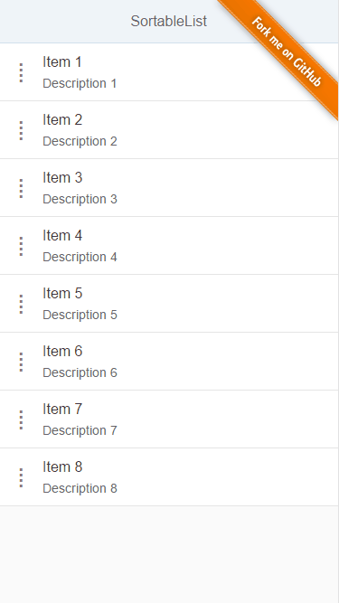

# SortableList

## [OpenUI5 Developer Blog](http://openui5.blogspot.com/2017/05/sortablelist.html)

> [UI5](http://openui5.org/) demo showing a sortable list with drag&drop handling.

### [Online Demo (SAP HCP)](https://sortablelist-p1940953245trial.dispatcher.hanatrial.ondemand.com/index.html)

### Highlights

> - demo how to use [jquery-ui-sortable](http://api.jqueryui.com/sortable/) with div elements on top of sap.m.List
> - adding touch support using [touch-punch](http://touchpunch.furf.com/) 
> - adding nice css shadow and transparency effect while dragging

## License

Released under the [Apache license](http://www.apache.org/licenses/). Have at it.